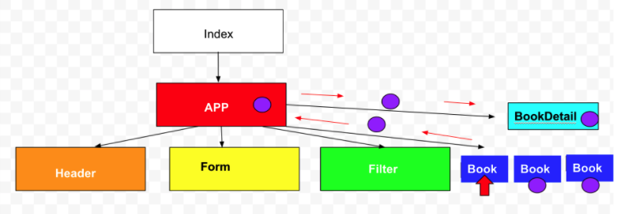

# Information Flow
## SWBAT
- [] Moving data from a child to a parent component. 
- [] Lift State using callbacks and events
- [] Pass callback functions as props

## State Review from yesterday
### What is state?
State is data controlled in our components that can be dynamic.
While it doesn't persist without a database, we can use this state to change what's being render on our browser. 

### Where should state be defined?
To keep the code dry, so state should be defined where it  will reach every component that needs that state.   

For example if only one component needs some state, it should be defined in that component.  


However if several components share state, state should be defined in the first common ancestor of those components. 


### UseState
We hold state using the useState method from react

```
import {useState} from 'react'
``` 

useState returns 2 things, a state object and a state setter/updater. When we useState we destructor these. We can set a default value by passing useState an argument. Here the default value to cats will rose.

Cats can now be used to render rose to our browser!

```
const [cats, setCats] = useState('rose')

return(
    <div>cats</div>
)
```

### Setting State
The setter we deconstructed from useState will be used to update the state value. 

onClick will call setCats and update it from rose to bubbles. 

once setCat is called our component will be rerendered with the new state rendered to the browser 

```
const [cats, setCats] = useState('rose')

return(
    <div onClick={() => setCats('bubbles')}>cats</div>
)
```


## Inverse Data flow and Lifting state


We often have components that share state. In the image above our Form will eventually need access to our bookList in order to add new books to state. While our BookCard needs access to our bookState in order to render the books. Defining state in a higher components lets us share state among components, which helps keep our code DRY. However, getting data back up to a parent component is a little harder than passing props down from a parent to a child.   

In order to "lift" data to a parent component we need to pass the child a "vehicle" to do so. A callback function. If we pass a function down to a child through props, we can invoke that function in a child component and pass it data from that child as an `argument`. That argument will be passed "up" to the parent component where the function was defined. Via scope, this can give us access to the state variable and setState function defined in that parent component.   

